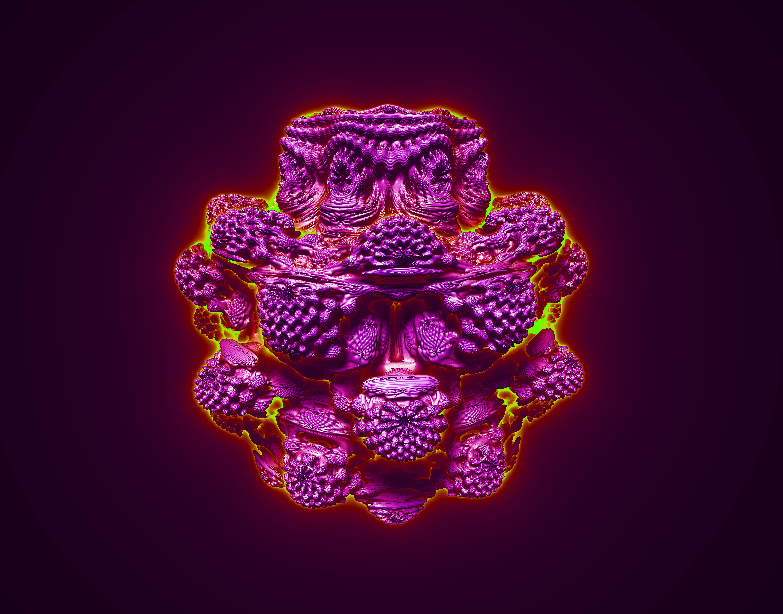

# Ray Marching GLSL Tests

Java program for rendering fractals in real time using ray marching techniques. 
The tool uses the Java OpenGL library (JOGL) and GLSL for implmenting the fragment shader that computes the output image.

The user can use the mouse for navigating and orbiting around the fractal.

## Example

  

